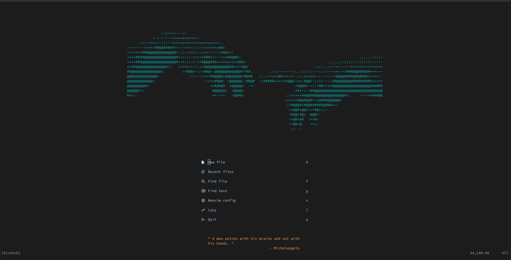

# Blyedev's neovim config

This repository holds my [lazy](https://github.com/folke/lazy.nvim) neovim configuration primarily intended for Arch Linux. Modifications are primarily done via lazy loaded plugins which I have tried to make as modular as possible for both clarity and ease of maintenance.

Good configurations are personal. Mine relies on the concept of [ego depletion](https://en.wikipedia.org/wiki/Ego_depletion) and assumes any and every impulse conveyed to your brain depletes cognitive ability. Because of this I have reduced the amount of plugins and visual noise to the absolute minimum assuming that each and every tool I use or see needlessly requires _more_ of my mind. This config assumes you will do the vast majority of your tasks in the terminal to take full advantage of muscle memory.

## Install and setup

Because I use lazy and mason, installation of plugins and subsequently LSPs is performed automatically on startup. Despite that, we need various tooling installed on the system. The following is a non-exhaustive list, you are encouraged to find missing dependencies via `:checkhealth`.

- **git** - for `lazy.nvim` to install dependencies
- **python**
- **node**
- **[Nerd Font](https://www.nerdfonts.com/)** of choice - This allows neovim to display various icons. I chose Droid Sans Mono
- **ripgrep** - fast grep utility
- **fd** - file searching utility

After obtaining the dependencies this repo is to be cloned into `~/.config/nvim/`

```bash
git clone git@github.com:blyedev/nvim-config.git ~/.config/nvim/
```

This config has been known to show errors on first startup so before assuming anything went wrong run nvim a few of times after `lazy` and `mason` are done.

## Features

- Dashboard via [alpha-nvim](https://github.com/goolord/alpha-nvim)
- Installation of editor tooling via [mason](https://github.com/williamboman/mason.nvim)
- LSP configuration via [nvim-lspconfig](https://github.com/neovim/nvim-lspconfig)
- Completion via [blink.cmp](https://github.com/Saghen/blink.cmp)
- Formatting support via [conform](https://github.com/stevearc/conform.nvim)
- Search via [telescope](https://github.com/nvim-telescope/telescope.nvim)
- Git changes highlighting via [gitsigns](https://github.com/lewis6991/gitsigns.nvim)
- Mappings visualized via [which-key](https://github.com/folke/which-key.nvim)
- a few less mission-critical QOL plugins...

## UI Demo



Besides this little piece of ASCII art, everything else is just a plain [tokyonight](https://github.com/folke/tokyonight.nvim) theme...

## Contributing

If you find anything that needs improving, do not hesitate to point it out or create a PR.

If you come across an issue, you can first use the `:checkhealth` command provided by nvim to trouble-shoot yourself. Please read the messages provided by health check carefully.

## Notes

Keep in mind this is not a plug and play solution. For that I highly recommend [LazyVim](https://github.com/LazyVim/LazyVim). If you would like to adopt this config it will most likely require a LOT of documentation reading on your part. Thankfully nearly everything in Neovim is incredibly well documented.

## Credits

There are way too many people that have contributed to me creating this for me to credit them all but here's a few of the major influences

- [TJ DeVries](https://github.com/tjdevries) - Neovim core maintainer, objectively biggest neovim youtuber
- [Pat *aka* theepic-dev](https://gitlab.com/theepic-dev) - a Django legend who convinced me to use neovim. Really recommend his [book "Linux for Djangonauts"](https://theepic.dev/books/lfd/)
- [Folke Lemaitre](https://github.com/folke) - THE Neovim plugin author, from whom I've "forked" half the files here
