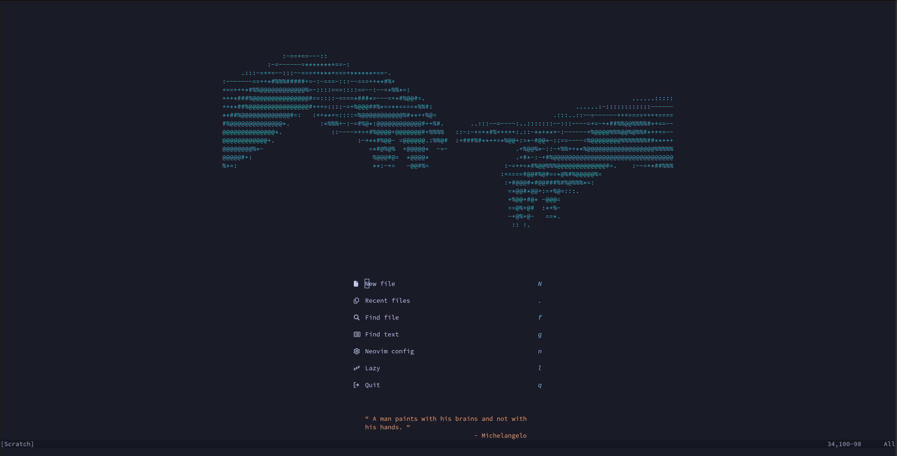
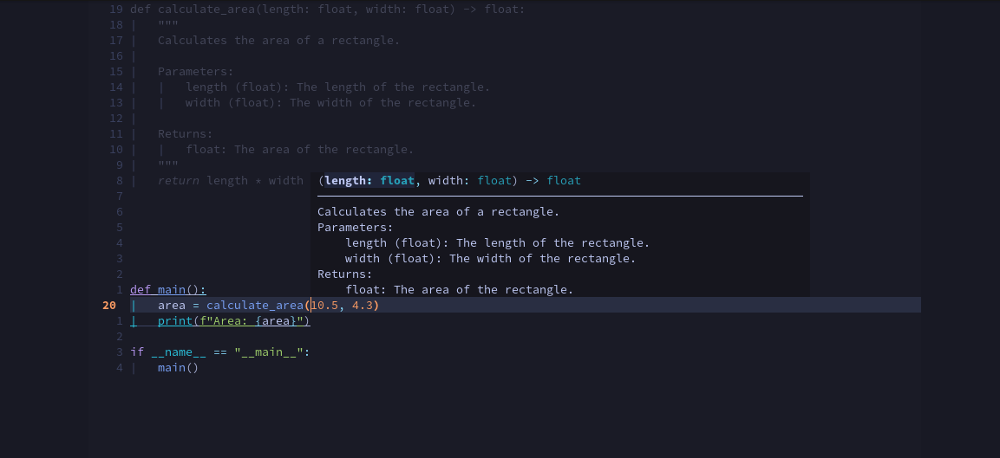

# Blyedev's neovim config

This repository holds my [lazy](https://github.com/folke/lazy.nvim) neovim configuration. That means the plguins are divided into modular files each configuring a set of functionalities that are closely related.



## Why neovim

This configuration is a direct result of my fascination with the concept of [ego depletion](https://en.wikipedia.org/wiki/Ego_depletion) and [automaticity](https://en.wikipedia.org/wiki/Automaticity). In here I have optimized my developing expirience to ensure the quantity of actions I have to conciously perform is minimized by binding them to keys thus relying on muscle memory. The amount of information consumed at once has also been reduced to a minimum, while using features such as blink.cmp [signature help](https://cmp.saghen.dev/configuration/signature.html) to maximize free working memory.

> Note: I am in no way a psychologist and these are topics I have only recenly named which have long resided as a gut feeling in me. Thank you to [Math Academy](https://mathacademy.com/pedagogy) for introducing me to the formal terms.

## Install and setup

Because I use lazy and mason, installation of plugins and subsequently LSPs is performed automatically at startup. Despite that, various tooling installed on the system is needed. The following is a non-exhaustive list, you are encouraged to find missing dependencies via `:checkhealth`.

- **git** - for `lazy.nvim` to install dependencies
- **python**
- **node**
- **[Nerd Font](https://www.nerdfonts.com/)** of choice - This allows neovim to display various icons. I chose Droid Sans Mono
- **ripgrep** - fast grep utility
- **fd** - file searching utility

After obtaining the dependencies this repo is to be cloned into `~/.config/nvim/`

```bash
git clone git@github.com:blyedev/nvim-config.git ~/.config/nvim/
```

This config has been known to show errors on first startup so before assuming anything went wrong run nvim a few of times after `lazy` and `mason` are done.

## Features

- Zen Mode via [zen-mode.nvim](https://github.com/folke/zen-mode.nvim) and [twilight](https://github.com/folke/twilight.nvim)
- Dashboard via [alpha-nvim](https://github.com/goolord/alpha-nvim)
- Installation of editor tooling via [mason](https://github.com/williamboman/mason.nvim)
- LSP configuration via [nvim-lspconfig](https://github.com/neovim/nvim-lspconfig)
- Completion via [blink.cmp](https://github.com/Saghen/blink.cmp)
- Formatting support via [conform](https://github.com/stevearc/conform.nvim)
- Search via [telescope](https://github.com/nvim-telescope/telescope.nvim)
- Git changes highlighting via [gitsigns](https://github.com/lewis6991/gitsigns.nvim)
- Mappings visualized via [which-key](https://github.com/folke/which-key.nvim)
- a few less mission-critical QOL plugins...

## UI Demo

### Signature help



Besides this ASCII art at the top and the signature help/zen mode demo, everything else is just a plain [tokyonight](https://github.com/folke/tokyonight.nvim) theme...

## Contributing

If you find anything that needs improving, do not hesitate to point it out or create a PR.

If you come across an issue, you can first use the `:checkhealth` command provided by nvim to trouble-shoot yourself. Please read the messages provided by health check carefully.

## Notes

Keep in mind this is not a plug and play solution. For that I highly recommend [LazyVim](https://github.com/LazyVim/LazyVim). If you would like to adopt this config it will most likely require a LOT of documentation reading on your part. Thankfully nearly everything in Neovim is incredibly well documented.

## Credits

There are way too many people that have contributed to me creating this for me to credit them all but here's a few of the major influences

- [TJ DeVries](https://github.com/tjdevries) - Neovim core maintainer, objectively biggest neovim youtuber
- [Pat _aka_ theepic-dev](https://gitlab.com/theepic-dev) - a Django legend who convinced me to use neovim. Really recommend his [book "Linux for Djangonauts"](https://theepic.dev/books/lfd/)
- [Folke Lemaitre](https://github.com/folke) - THE Neovim plugin author, from whom I've "forked" half the files here
